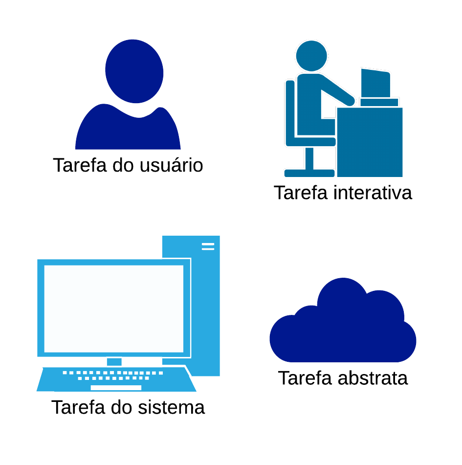
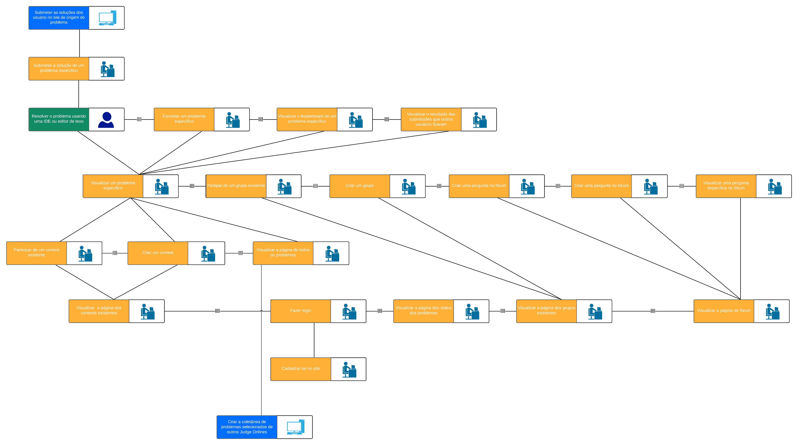
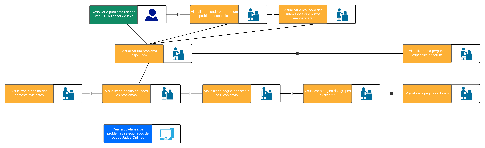

## 1. Introdução

O modelo de árvores de tarefas concorrentes (ConcurTaskTrees – CTT) foi criado para auxiliar a avaliação e design (Paterno, 1999). Nesse modelo, existem quatro tipos de tarefas:

- tarefas do usuário, realizadas fora do sistema;
- tarefas do sistema, em que o sistema realiza um processamento sem interagir com o usuário;
- tarefas interativas, em que ocorrem os diálogos usuário–sistema; e
- tarefas abstratas, que não são tarefas em si, mas sim uma representação de uma composição de tarefas que auxilie a decomposição.

## 2. Escolha da técnica

Como já tínhamos escolhido o GOMS como uma técnica para análise de tarefas, percebemos que ela é muito descritiva e textual, então escolhemos o CTT por ser mais imagética e visual, ajudando a facilitar a análise de cada tarefa da aplicação, percebemos que ela também ajuda na otimização da separação das tarefas, facilitando a compreensão de cada função ou tarefa e em qual tipo ela se encaixa.

## 3. Tarefas

- Tarefa interativa

    - Sem login

        - Visualizar todos os problemas
        - Visualizar um problema específico
        - Visualizar o leaderboard de um problema específico
        - Visualizar o resultado das submissões que outros usuários fizeram
        - Visualizar os status dos problemas
        - Visualizar contests
        - Visualizar todos os usuário
        - Visualizar um usuário específico
        - Visualizar o fórum
        - Visualizar os grupos existentes
        - Cadastrar-se no site
        - Realizar login

    - Com login

    	-  Submeter a solução de um problema espécifico
        -  Favoritar um problema específico
        - Participar de um de um grupo
        - Criar um grupo
        - Partipar de um contes
        - Criar um contes

- Tarefa de usuário

    - Resolver o problema usando uma IDE ou editor de texto

- Tarefa do sistema

    - Criar a coletânea de problemas selecionados de outros Judge Onlines
	- Submeter as soluções dos usuário no site de origem do problema

- Tarefa abstrata

    - Não conseguimos encontrar ou perceber nenhuma

## 4. Diagramas das árvores de tarefas concorrentes

 
    <a href="../../../assets/analiseDeTarefas/CTT/legendaCTT.png" target="_blank">
        </img>
    </a>
    <figcaption>(Figura 1) Legenda das tarefas que serão dispostas no CTT</figcaption>
    <a href="../../../assets/analiseDeTarefas/CTT/comLoginCTT.png" target="_blank">
        </img>
    </a>
    <figcaption>(Figura 2) CTT baseado em um usuário que esteja logado</figcaption>
    <a href="../../../assets/analiseDeTarefas/CTT/semLoginCTT.png" target="_blank">
        </img>
    </a>
    <figcaption>(Figura 3) CTT baseado em um usuário que não esteja logado (abra)</figcaption>

## Referência

> Barbosa, S. D. J.; Silva, B. S. da; Silveira, M. S.; Gasparini, I.; Darin, T.; Barbosa, G. D. J. (2021)
Interação Humano-Computador e Experiência do usuário. Autopublicação.

## Versionamento

| Versão | Data | Modificação | Autor |
|--|--|--|--|
| 1.0 | 10/03/2021 | C.T.T. produzida | Ian e Ítalo |
| 1.0 | 13/03/2021 | C.T.T. adicionada | Ítalo |
| 1.0.1 | 16/03/2021 | Revisão feita| Ian |