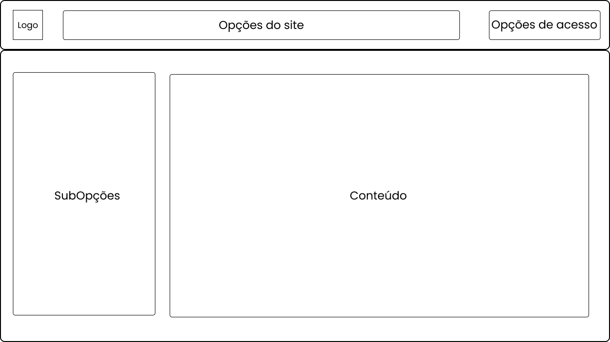
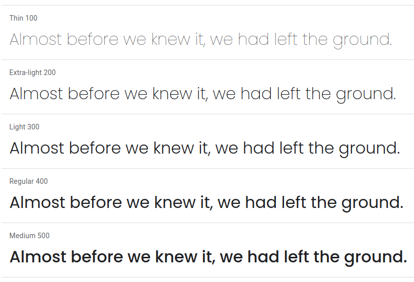
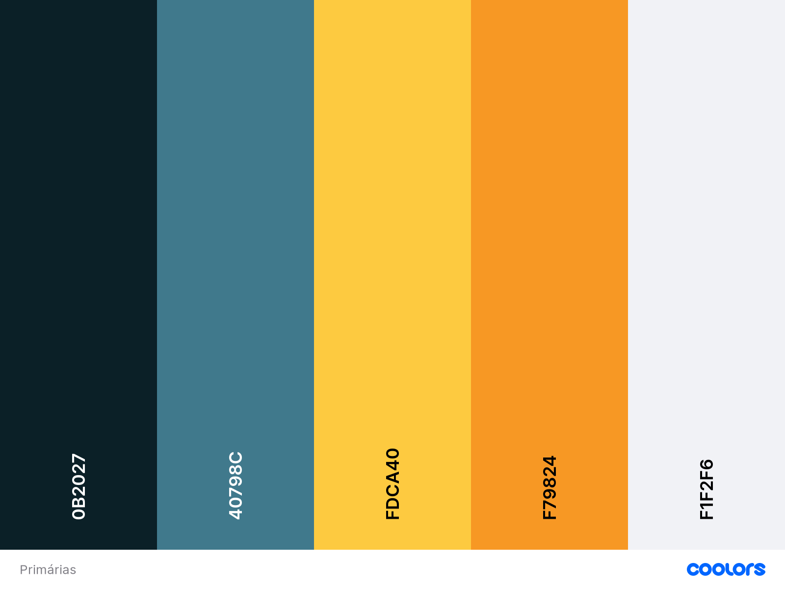
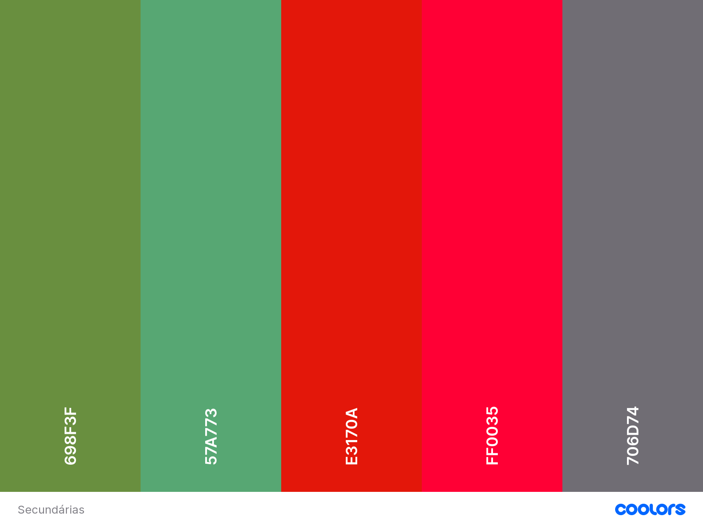

## Introdução

### Objetivo do guia de estilo

O guia de estilo representa as principais decisões de design tomadas, no intuito de serem incorporadas no produto final. Entre os objetivos do guia de estilo estão: servir como uma ferramenta de comunicação entre os membros da equipe de design e também com a equipe de desenvolvimento; e servir como uma base de consulta para que importantes decisões de design possam ser facilmente reutilizadas nas discussões sobre extensões ou versões futuras do produto.

No escopo do trabalho, a equipe usará o guia de estilo com o objetivo de servir como um guia para a criação dos protótipos de média e alta fidelidade do site Vjudge, ao longo do processo de desenvolvimento do projeto.

### Organização e conteúdo do guia de estilo

A organização do guia de estilo será definido a partir do livro Interação Humano Computador da autora Simone Barbosa e será orientado a partir do ciclo de vida Mayhew, o qual sugere que o guia de estilo tem que ser seguido ou modificado a cada nível de prototipagem.

### Público-alvo do guia de estilos (programadores, gerentes, equipe de suporte)

O público-alvo deste guia de estilo somos nós alunos que iremos nos basear para o desenvolvimento dos protótipos e também para os desenvolvedores e/ou designer que desenvolverão de forma concreta este sistema.

### Como utilizar o guia (em produção e manutenção)

Será utilizado para guiar durante as prototipagens quais serão os estilos que teremos que implementar.

### Como manter o guia

A cada mudança ou percepção de que algo na prototipagem ou até mesmo no brainstorm da estilização do guia, ele deverá ser modifcado para que seja uma fonte primária de como é a estilização do sistema.

## Resultados de análise

### Descrição do ambiente de trabalho do usuário

O usuário necessita de um ambiente que não tenha problemas para se manter no site ou distrações durante seu uso, pois como trata-se de um ambiente didático e educacional, creio que deverá seguri as mesmas normas de um ambiente fisíco bom para esta tarefa de estudo, ou seja, que haja a menor quantidades de ruídos possíveis durante a experiência e uso do usuário no sistema.

## Elementos de interface

### Disposição espacial e grid

Nos baseamos já no site original, no entanto, creio que o design do layout não é muito agradável à experiência do usuário, por isso redesenhamos para que se torna mais confortável 

 
    </img>
    <figcaption>(Figura 1) Layout e grid</figcaption>

### Janelas

Os protótipos possuirão as mesmas janelas do site original, porém faremos uma disposição diferente, a mudança ou a retirada das informações das diferentes janelas que existirão.

### Tipografia

A fonte a ser utilizada por nós será a <a href="https://fonts.google.com/specimen/Poppins?preview.text_type=custom" target="_blank">Poppins</a>, projetado por Ninad Kale e Jonny Pinhorn.

 
    </img>
    <figcaption>(Figura 2) Exemplo fonte Poppins</figcaption>

### Símbolos não tipográficos

        
| Ícones | | | | |
|:--:|:--:|:--:|:--:|:--:|
|  |  |  |  |  |
|  |  |  |  |  |
|  |  |  |  |  |
|  |  |  |  |  |

### Cores

#### Cores Principais

    Após uma análise do perfil do usuário e o círculo cromático, a escolha das cores principais foi feita com após a aprovação por parte dos integrantes do grupo. Por exemplo, a escolha do azul e do laranja foi feita com base na sua complementariedade.

 
    </img>
    <figcaption>(Figura 3) Cores principais</figcaption>

<a href="https://coolors.co/0b2027-40798c-fdca40-f79824-f1f2f6" target="_blank">Link da Imagem aqui</a>

#### Cores Secundárias

    As cores secundárias foram definidas como uma paleta para serem utilizadas em informações complementares, como a utilização do verde para sinalização de resposta correta ou até mesmo o vermelho para um erro possível.

 
    </img>
    <figcaption>(Figura 4) Cores secundarias</figcaption>

<a href="https://coolors.co/698f3f-57a773-e3170a-ff0035-706d74" target="_blank">Link da Imagem aqui</a>

### Animações

Nossos protótipos não terão animações, pois não convém fazê-las, já que pretendemos manter o site simples e objetivo.

## Elementos de interação

### Estilos de interação

O usuário irá realizar as interações com o site através de elementos não tipográficos e de botões ou hiperlinks contendo elementos tipográficos.
tá escrevendo besteira

### Seleção de um estilo

O estilo foi escolhido de forma a maximizar a eficiência do usuário e a padronização das interações com o sistema, tão quanto para facilitar a visualização das principais ferramentas ao mesmo tempo mantento a simplicidade da aplicação.

### Aceleradores (teclas de atalho)

Os protótipos não possuirão elementos aceleradores ou teclas de atalhos.

## Elementos de ação

### Preenchimento de campos

Todos os campos de preenchimento devem ser preenchidos manualmente pelo usuário seguindo suas necessidades.

### Seleção

O usuário tem liberdade para fazer quaisquer seleções desejadas dentro do site, portanto nao há necessidade de bloqueio da seleção.

### Ativação

As ativações presentes no site estão fundadas principalmente nos fundamentos de usabilidade possibilitando uma maior liberdade para o usuário.

## Vocabulário e padrões

### Terminologia

Como o site tem um foco no apredizagem de programação, a terminologia das palavras podem tanto ser direcionada a usuários novatos, em questões mais fáceis, como também terminologias mais complicadas, visando um aspecto competitivo e direcionadas a usuários mais experientes.

### Tipos de tela (para tarefas comuns)

O protótipo de alta fidelidade contará com todas as telas abaixo, e o protótipo de média fidelidade contará com as telas que julgarmos mais importantes:

- Tela inicial, com a descrição do site e a coletânea de online judges que dão suporte ao site
- Tela de cadastro
- Tela de login
- Tela das questões
- Tela de uma questão específica
- Tela do ranking dos usuários na questão específica
- Tela de status
- Tela dos contests
- Tela de um contest específico
- Tela dos usuários
- Tela de um usuário específico
- Tela dos grupos
- Tela dos grupos em que o usuário é participante
- Tela do fórum
- Tela de uma pergunta específica

### Sequências de diálogos (e.g., para feedback ou confirmação de uma operação)

Haverá sequências de diálogos para o usuário, no momento que este realizar alguma ação errada ou equivocada, como por exemplo, um usuário deslogado tentar executar algo que necessite de login para fazer. Outra situação na qual ocorrerá a sequência de diálogos, será no momento em que o usuário realizar alguma tarefa que esteja que necessite de confirmação, como por exemplo, ao enviar um solução para uma questão específica.

## Referência

> Barbosa, S. D. J.; Silva, B. S. da; Silveira, M. S.; Gasparini, I.; Darin, T.; Barbosa, G. D. J. (2021) Interação Humano-Computador e Experiência do usuário. Autopublicação.

## Versionamento

| Versão | Data | Modificação | Autor |
|--|--|--|--|
| 1.0 | 23/03/2021 | Guia de estilo produzido | Todos os integrantes |
| 1.0.1 | 25/03/2021 | Guia de estilo revisado | Todos os integrantes |
