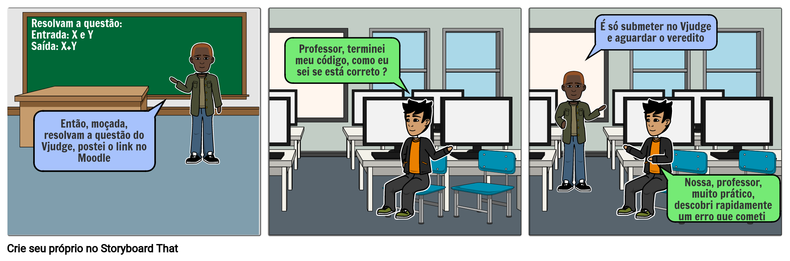

## 1. Introdução

O storyboard é um exemplo de prototipagem de baixa fidelidade que costuma ser usado em conjunto com cenários. Um storyboard consiste em uma série de esboços que mostram como um usuário pode progredir em uma tarefa usando o produto em desenvolvimento. Pode ser uma série de esboços de tela ou uma série de cenas mostrando como um usuário pode executar uma tarefa usando um dispositivo interativo.

## 2. Objetivo

O storyboard fornece mais detalhes e oferece às partes interessadas a chance de representar um protótipo, interagindo com ele percorrendo o cenário.

## 3. Storyboards

    A intenção dos storyboards abaixo servem para relatar alguns dos cenários que definimos e como a ausência e a presença da aplicação Vjudge interfere e ajuda nos exemplos de cenários apresentados.

## 3.1. Storyboard 1

O storyboard abaixo relata um cenário em que o professor passa um exercício de programação para os alunos.

 
    </img>
    

    <figcaption>Figura 1.1 - Situação de uma atividade de programação em que não há a presença do Vjudge</figcaption>
    

 
    </img>
    

    <figcaption>Figura 1.2 - Situação de uma atividade de programação em que há a presença do Vjudge</figcaption>
    

## 3.2. Storyboard 2

O storyboard abaixo relata um cenário em que o professor cria um torneio ou uma compretição para dar um ponto extra ao vencedor.

 
    </img>
    

    <figcaption>Figura 2.1 - Situação de uma atividade de programação em que não há a presença do Vjudge</figcaption>
    

 
    </img>
    

    <figcaption>Figura 2.2 - Situação de uma atividade de programação em que há a presença do Vjudge</figcaption>
    

## 3.3. Storyboard 3

O storyboard abaixo relata um cenário em que uma pessoa conhece o Vjudge pela primeira vez, está situação só tem o caso com a presença do Vjudge pois, relata o primeiro contanto entre o usuário e o sistema.

 
    </img>
    

    <figcaption>Figura 3 - Situação de uma atividade de programação em que há a presença do Vjudge</figcaption>
    

## Referências bibliográficas

> Barbosa, S. D. J.; Silva, B. S. da; Silveira, M. S.; Gasparini, I.; Darin, T.; Barbosa, G. D. J. (2021) Interação Humano-Computador e Experiência do usuário. Autopublicação.

> “Design de Interação: Além da Interação Humano-Computador eBook: Rogers, Yvonne, Sharp, Helen, Preece, Jenny: Amazon.com.br: Loja Kindle”, [s.d.]

## Versionamento

| Versão | Data | Modificação | Autor |
|--|--|--|--|
| 1.0 | 07/04/2021 | Criação do storyboard 1 | Ítalo |
| 1.0 | 07/04/2021 | Criação do storyboard 2 | Guilherme |
| 1.0 | 07/04/2021 | Criação do storyboard 3 | Ían |
| 1.0 | 07/04/2021 | Criação dos textos dos storyboards | Ítalo |
