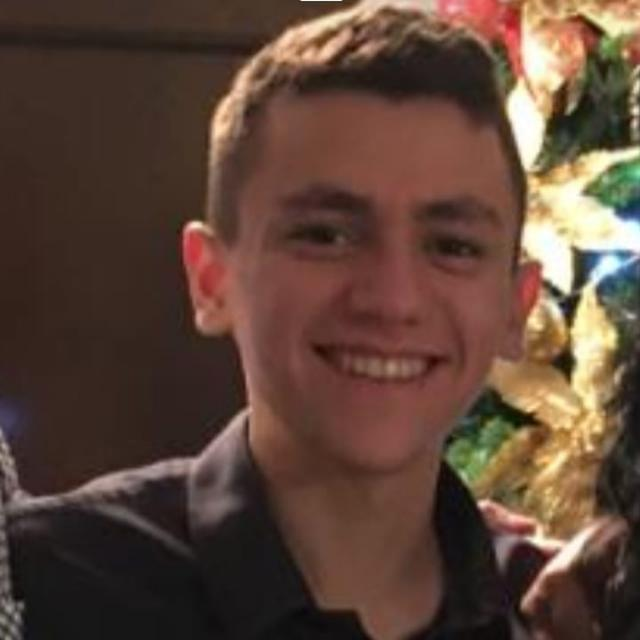
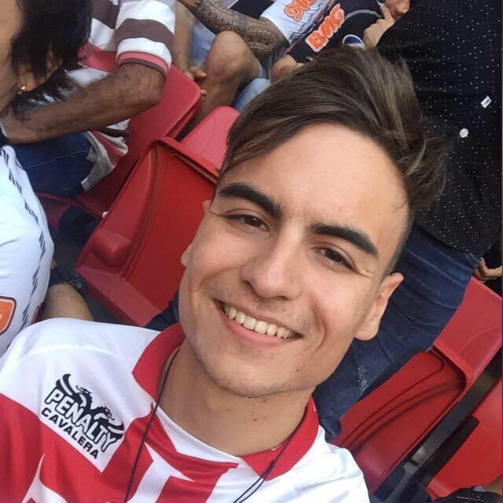
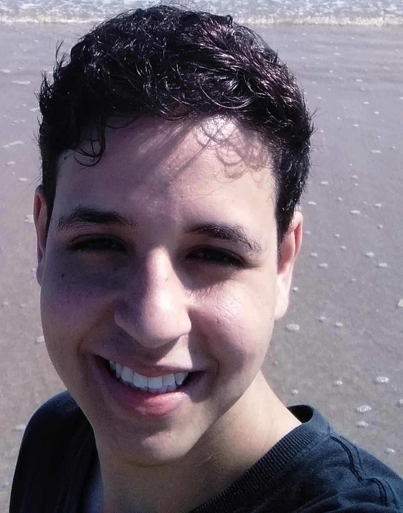
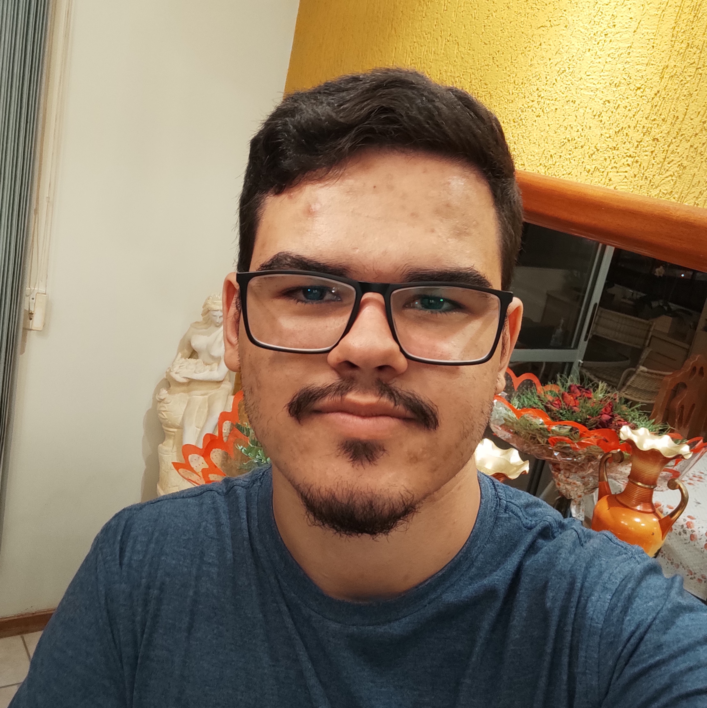

# Sobre

  

 

Repositório do grupo 06 - Vjudge, destinado ao desenvolvimento da documentação do projeto final da disciplina de Interação humano-computador, ministrado pelo professor André Barros de Sales, na Universidade de Brasília - Gama, durante o período 2020/2.

O Vjudge é um site para resolução de problemas de programação e para criação de listas de exercícios relacionados a esta área, porém não se identifica como um juíz online pois, ele apenas faz uma coletânea de problemas de outros OJs, submetendo as soluções feitas nele no site de origem do problema.

# Contribuidores

| Foto | Matrícula | Nome | GitHub | E-mail |
|:--:|:--:|:--:|:--:|:--:|
||180074741|Caio Martins Ferreira|linktocaio|caio@wgo.com.br|
||180145088|Gabriel Bonifácio Perez Nunes|gabrielbpn|gabrielbpn0802@gmail.com|
||180101617|Guilherme de Morais Richter|guilhermemoraisr|guilhermemoraisr@gmail.com|
||180102087|Ian Fillipe Pontes Ferreira|IanFPFerreira|ianfillipe@gmail.com|
||180102656|Ítalo Vinícius Pereira Guimarães|italovinicius18|italovinicius18@yahoo.com|
