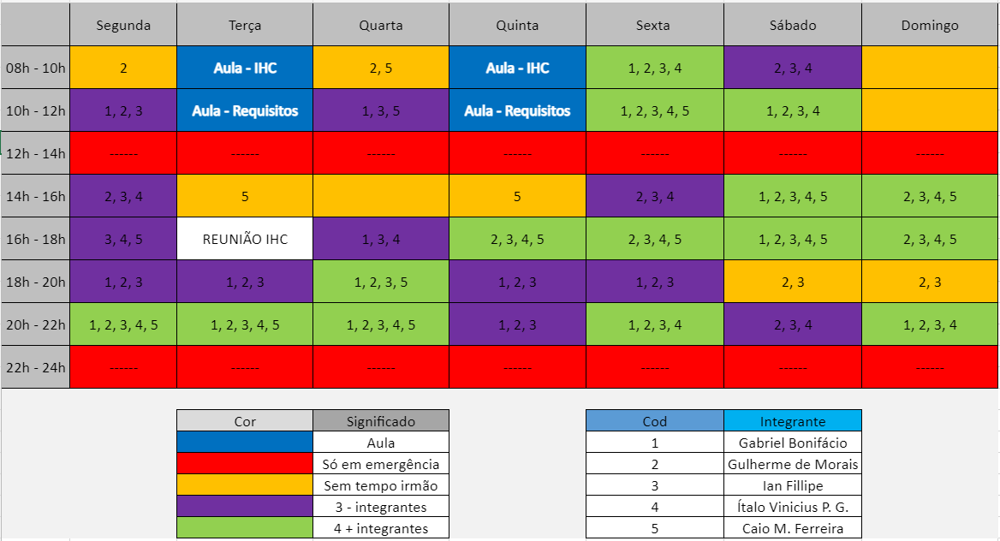

# Planejamento

## 1. Sites avaliados individualmente

- Caio Martins Ferreira - <a href="http://flytec.com.py/" target="_blank">Flytec</a>
- Gabriel Bonifácio Perez Nunes -  <a href="http://www.portaltransparencia.gov.br/" target="_blank">Portal da transparência</a>
- Guilherme de Morais Richter - <a href="https://www.notalegal.df.gov.br/" target="_blank">Nota legal</a>
- Ian Fillipe Pontes Ferreira - <a href="https://www.infojobs.com.br/" target="_blank">InfoJobs</a>
- Ítalo Vinícius Pereira Guimarães - <a href="https://vjudge.net/" target="_blank">Vjudge</a>

Em consenso, escolhemos o Vjudge por ser um site que já utilizamos algumas vezes e também possui um escopo menor, facilitando no mapeamento do site e na avaliação heurística

O planejamento do Vjudge está hospedado <a href="https://unbbr-my.sharepoint.com/:b:/g/personal/180102656_aluno_unb_br/EX75t_s9mNpNqDmMVwW0GVQBwhi85s7oR4KbHU-CuHLaRQ?e=u3fBUj" target="_blank">aqui</a> e a avalição heurística está <a href="https://unbbr-my.sharepoint.com/:b:/g/personal/180102656_aluno_unb_br/ESQXBSFnw11DgXHcbxBIzXIBUiBmyUN_TcjCwj0S0EOihg?e=ZU2ZgB" target="_blank">aqui</a>.

## 2. Cronograma

A partir dos prazos estipulados pela disciplina e pela disponibilidade dos integrantes, o grupo organizou um cronograma com o intuito de realizar as tarefas propostas no projeto.

OBS.: Essas datas podem mudar futuramente.

### 2.1 Cronograma de atividades

|Título|Data|Descrição|
|:-----:|:-----------------------------:|:----------------------------------:|
|Planejamento do Projeto|05/03|Planejamento do Projeto e Processo de Design|
|Entrega da apresentação do projeto|19/03| Perfil do usuário, Personas e Análise de tarefas|
|Entrega da apresentação do projeto|26/03|Princípios Gerais de Projeto, Metas de usabilidade, Guia de Estilo. (Fase: análise de requisitos)|
|Entrega da apresentação do projeto|09/04|Planejamento da Avaliação e planejamento do relato dos resultados da avaliação do Storyboard e Análise de tarefas.|
|Entrega da apresentação do projeto|23/04|Relato dos resultados do Story Board, Análise de tarefas e o Planejamento da Avaliação e do relato dos resultados da avaliação do Protótipo de Papel.|
|Entrega da apresentação do projeto|30/04|Relato dos resultados do Protótipo de Papel e Planejamento daAvaliação e do relato dos resultados da avaliação do protótipo de alta fidelidade|
|Verificação dos artefatos.|04/05|Verificação dos artefatos construídos no projeto|
|Entrega da apresentação do projeto final|10/05|Resultados do Protótipo de Papel e Planejamento da Avaliação e o relato dos resultados da avaliação do protótipo de alta fidelidade.|

### 2.2 Disponibilidade dos integrantes

Tabela que mostra a disponibilidade de cada integrante, no intuito de o próprio grupo ter conhecimento de quando todos os partipantes poderão se reunir para discutir e trabalhar no projeto. 

 
  

## 3. Metodologia adotada
e

No quesito das metodologias adotadas e de experiências passadas, iremos adotar um método ágil para desenvolver o projeto, tais como:

## XP - Extreme programming

Pensamos em uma metodologia para se trabalhar, porém não conseguimos nos identificar com nenhuma, no entanto, a partir da lista de exercícios de Requisitos de Software sobre os métodos ágeis, escolhemos a metodologia XP, seguindo seus valores de comunicação, simplicidade, feedback, coragem e respeito. Adotamos esta metodologia para descrever o nosso processo de trabalho e desenvolvimento do projeto.

Dentre as variáveis de controle em projetos (custo, tempo, qualidade e escopo), há um foco explícito em escopo. Para isso, recomenda-se a priorização de funcionalidades que representem maior valor possível para o negócio. Desta forma, caso seja necessário a diminuição de escopo, as funcionalidades menos valiosas serão adiadas ou canceladas.

#### Reuniões semanais

Encontros que faremos toda semana para dividir tarefas e discutir sobre quais são as melhores maneiras de desenvolver este projeto, debatendo sobre as técnicas e modos de aplicá-las em relação ao Vjudge. As atas e conteúdo das reuniões ficarão disponíveis na área de atas, aqui em nosso site.

#### Criação e disponibilidade de issues

Vamos listar todas as tarefas que temos que fazer durante a semana e qual o status dessa issue, se resolvermos essa issue, então a fechamos, porém se estivermos tendo problemas, vamos tentar descrever quais problemas que estamos sofrendo.

#### Divisão de tarefas

A partir das reuniões, vamos dividir quais funções são específicas para cada membro e vamos listá-las nas nossas plataformas mais diretas, como Discord e Telegram, essas atividades são separadas por rodízio de dificuldade e trabalho, sendo os integrantes resposáveis por comunicarem quem ficou com a tarefa mais pesada na entrega anterior e assim ficarem com uma tarefa mais simples na tarefa atual

#### Responsabilidades

As pessoas que irão interferir diretamenta no desenvolvimento do código será apenas o Ítalo Vinícius, ele se baseará na entrega de cada participante para atualizar o website, o responsável por fazer a revisão será o Ian Fillipe, porém todos do grupo terão essa responsabilidade de maneira secundária

## 4. Ferramentas Utilizadas

| Ferramenta | Nome | Descrição |
|:--:|:--:|:--:|
||Vjudge|Site para criar ou exercitar problemas de programação|
||GitHub|Ferramenta de controle de versão de arquivos e código|
||Microsoft Word|Processador de texto para arquivos .doc|
||Canva|Plataforma de design gráfico e produção de slides|
||Figma|Ferramenta de edição de imagens|
||Lucidchart|Plataforma de desenho e compartilhamento de diagramas|
||Microsoft Teams|Ferramenta de chamada e gravação de vídeos|
||Discord|Ferramenta principal de chamada entre o grupo|
||Telegram|Mensageiro principal do grupo para diálogo ocasional|
||VSCode|Editor de código-fonte|

## Referências:

> SIMONE DINIZ JUNQUEIRO BARBOSA, BRUNO SANTANA DA SILVA, Interação Humano-Computador, 1a . Edição, Editora Campus, 2010.

## Versionamento
| Versão | Data | Modificação | Autor |
|--|--|--|--|
| 1.0 | 02/03/2021 | Criação do projeto base | Ítalo |
| 1.1 | 02/03/2021 | Adicionando horários livres | Ítalo |
| 1.2 | 03/03/2021 | Adicionando cronograma de atividades | Ítalo |
| 1.3 | 03/03/2021 | Adicionando as metodologias adotadas | Ítalo |
| 1.4 | 03/03/2021 | Adicionando o processo de design | Ítalo |
| 1.5 | 13/03/2021 | Separando o processo de design em outra página (feedback)| Ítalo |
| 1.5.1 | 13/03/2021 | Mudando o tamanho dos ícones das ferramentas| Ítalo |
| 1.6 | 13/03/2021 | Adicionando sites avaliados individualmente| Ítalo |
| 1.6 | 13/03/2021 | Especificando metodologia adotada| Ítalo |
| 1.6.1 | 16/03/2021 | Revisão feita| Ian |